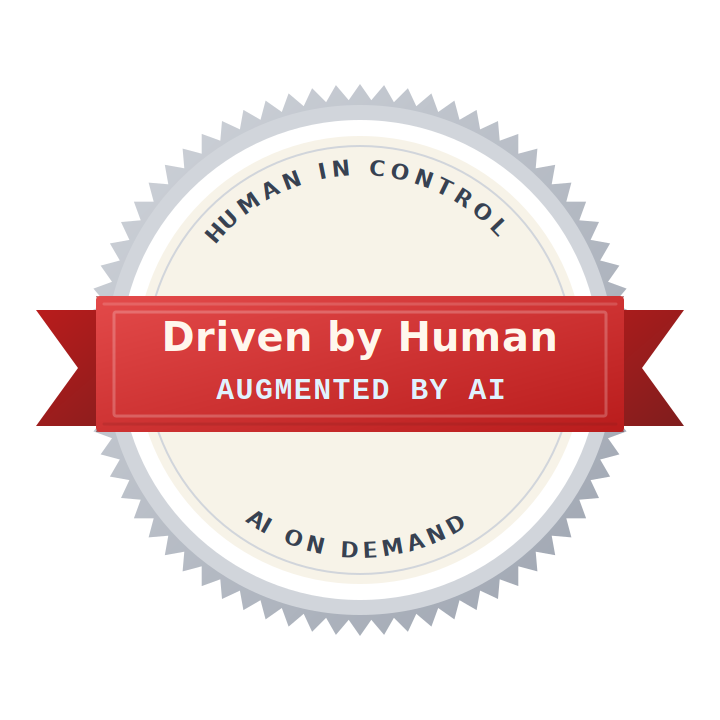

# AI Augmented Signature

A signature and badge to mark projects built with human intent and AI augmentation.

## Signature

> **Driven by 🧠, augmented by 🤖**
> 
> **Human in control, AI on demand**
> 
> *Because the world still needs warm brains behind smart machines.*

## The Stance

Use this signature to express your **passion**, **craftsmanship**, and **human intent** behind your project.

No matter which AI coding paradigm you work with:

* Vibe Coding
* AI-Assisted Coding
* Agentic Coding

## Badge

Use this badge in your project README to signal your carbon-based craftsmanship.

## License

Released under [CC0 1.0](./LICENSE) — public domain. Use it however you want, no attribution required.
